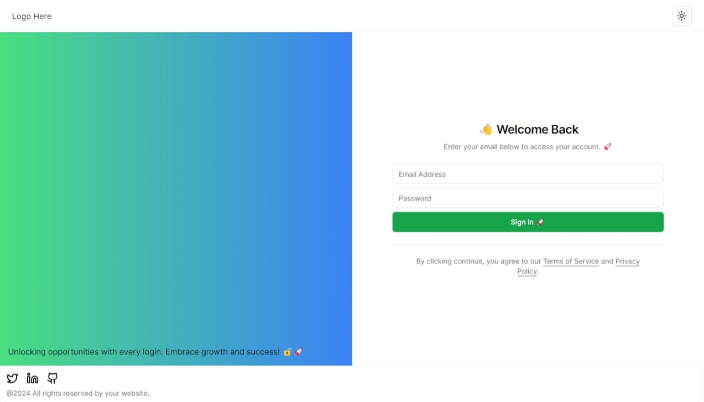
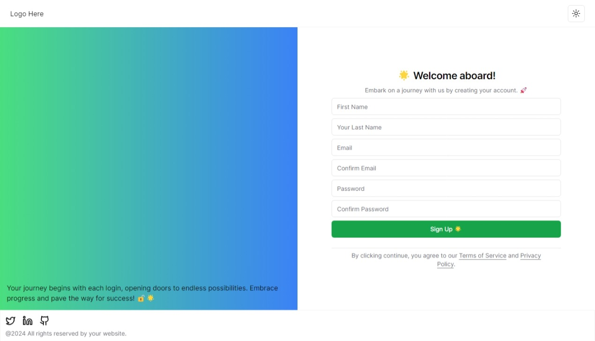
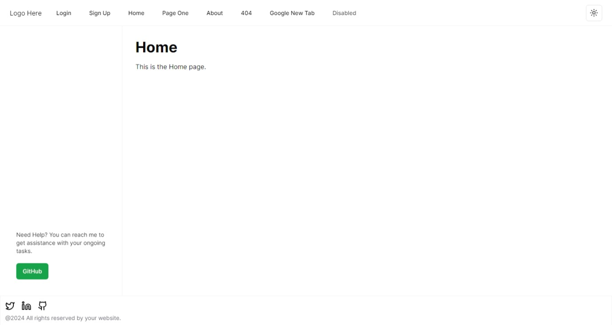
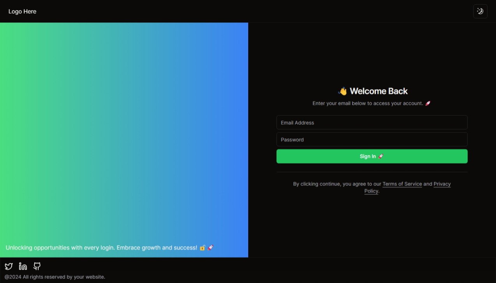
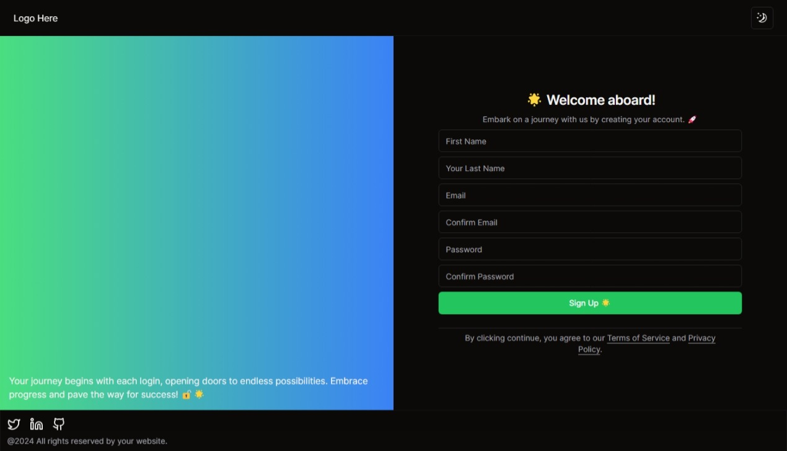
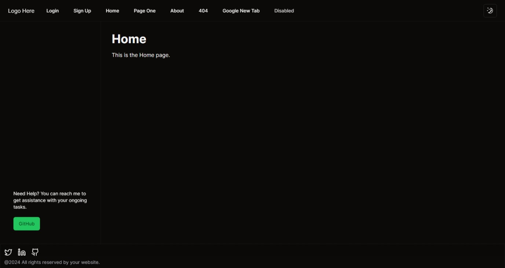
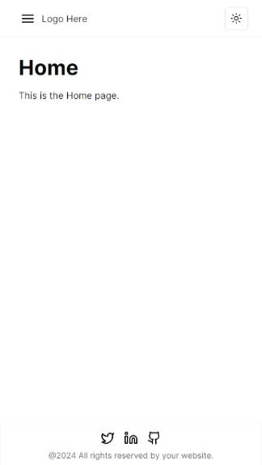
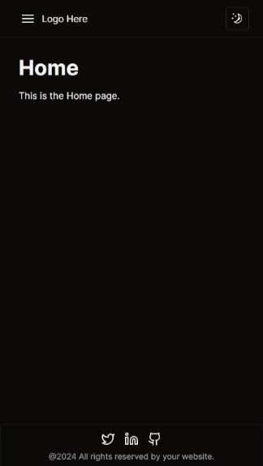
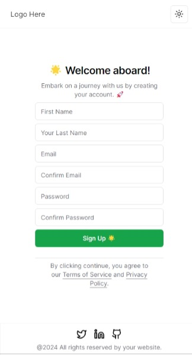

# Shadcn/ui - Next.js Template

Shadcn/ui - Next.js Template is a customizable Next.js template that comes with authentication pages, custom layouts, dark mode, Tailwind CSS, ESLint, Prettier, and a well-structured navigation and footer.

Don't forget to star the repository if you find it useful! ⭐️

Check it out: https://shadcnui-next-js-template.vercel.app

## Features

- **Authentication**: Includes authentication pages for login and signup.🔐
- **General Pages**: Comes with pre-built general pages like home, page-one, and about.📄
- **Custom Layouts**: Easily customize layouts for different sections of your application.🖌️
- **Dark Mode**: Built-in support for dark mode to enhance user experience.🌙
- **Tailwind CSS**: Utilize the power of Tailwind CSS for efficient styling.💅
- **ESLint and Prettier**: Maintain code quality with ESLint and Prettier integration.🧹
- **Navigation**: Seamless navigation with an organized and easy-to-use navigation architecture.🗺️
- **Footer**: A pre-designed footer for your application.🦶

## Preview

### Light Mode





### Dark Mode





### Mobile






## Project Structure

```plaintext
.
├── /app/              # Main application code
│   ├── /(auth)/       # Authentication-related components and pages
│   │   ├── login      # Login page components
│   │   └── signup     # Signup page components
│   ├── (general)      # General pages components
│   │   ├── home       # Home page components
│   │   ├── about      # About page components
│   │   └── page-one   # Page One components
│   ├── page.js        # Generic page component
│   └── layout.js      # Layout component for custom layouts
├── /assets/           # Static assets (images, icons, etc.)
├── /components/       # Reusable React components
├── /config/           # Configuration files (e.g., Paths)
├── /layouts/          # Custom layout configurations
├── /styles/           # Global styles, including dark mode
└── /types/            # TypeScript type definitions
```

## Getting Started

### Prerequisites

Make sure you have Node.js and pnpm installed on your machine. 🚀 Alternatively, you can use your favorite package manager.

```bash
# Install dependencies
pnpm install
```

### Development

Run the development server:

```bash
pnpm run dev
```

Open [http://localhost:3000](http://localhost:3000) in your browser.🌐

### Production

Build the application for production:

```bash
pnpm run build
```

Start the production server:

```bash
pnpm start
```

## Customization

### ESLint and Prettier

Maintain code quality with ESLint and Prettier. Configuration files are in the root directory.🧹

## Deployment

Deploy this project to your preferred hosting platform, such as Vercel or Netlify.

## Contributing

Feel free to contribute to this project. Open issues, submit pull requests, or suggest new features and improvements.🤝

## Stay Connected

Connect with me on:

- [LinkedIn](https://no.linkedin.com/in/fahddaher995)
- [Twitter](https://twitter.com/fahddaher)
- [GitHub](https://github.com/Painkiller995)

If you find this project helpful, consider supporting it by [making a donation](https://www.paypal.com/donate/?hosted_button_id=5W56HWZ6DYZS4). 💖

## License

This project is licensed under the MIT License - see the [LICENSE](LICENSE) file for details.

## Acknowledgments

- [Next.js Documentation](https://nextjs.org/docs)
- [Tailwind CSS Documentation](https://tailwindcss.com/docs)
- [ESLint Documentation](https://eslint.org/docs)
- [Prettier Documentation](https://prettier.io/docs/en/)

**Project Visitors**

